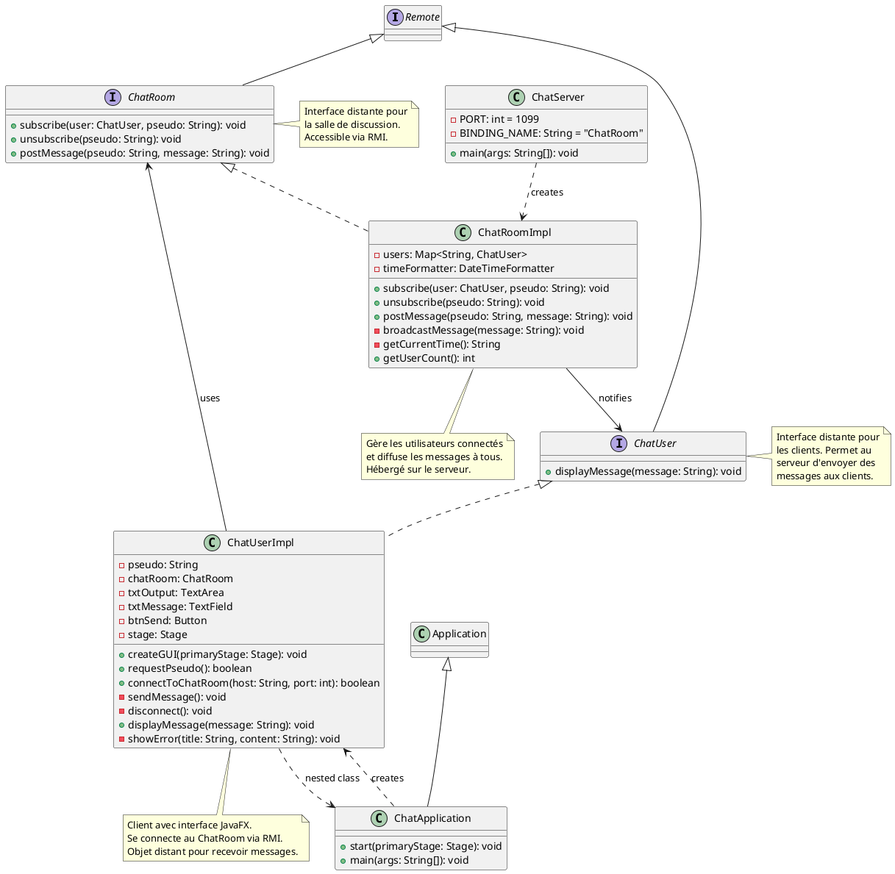
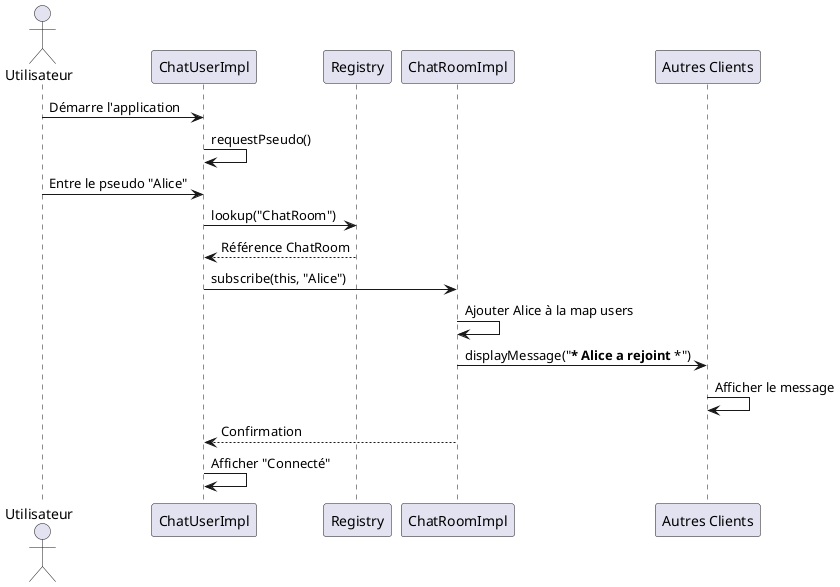
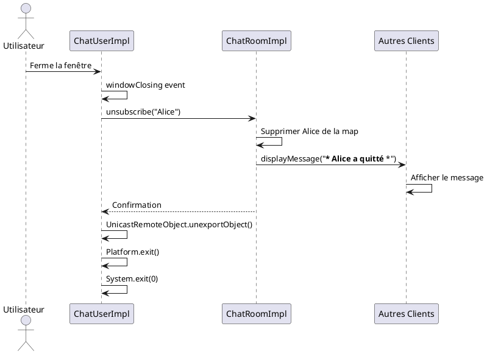

# Architecture du Projet ChatRoom RMI

## Diagramme de Classes (Format PlantUML)



## Diagramme de Séquence - Inscription d'un Client



## Diagramme de Séquence - Envoi de Message

```plantuml
@startuml

actor "Alice" as Alice
participant "ChatUserImpl\n(Alice)" as ClientA
participant "ChatRoomImpl" as Server
participant "ChatUserImpl\n(Bob)" as ClientB
participant "ChatUserImpl\n(Charlie)" as ClientC
actor "Bob" as Bob
actor "Charlie" as Charlie

Alice -> ClientA: Tape "Bonjour!"
Alice -> ClientA: Clique "Envoyer"
ClientA -> Server: postMessage("Alice", "Bonjour!")

Server -> Server: Formatter le message\n"[HH:mm:ss] Alice: Bonjour!"

Server -> Server: broadcastMessage()

par Diffusion parallèle
    Server -> ClientA: displayMessage("[10:30:15] Alice: Bonjour!")
    ClientA -> ClientA: Afficher dans txtOutput
and
    Server -> ClientB: displayMessage("[10:30:15] Alice: Bonjour!")
    ClientB -> ClientB: Afficher dans txtOutput
    ClientB -> Bob: Notification visuelle
and
    Server -> ClientC: displayMessage("[10:30:15] Alice: Bonjour!")
    ClientC -> ClientC: Afficher dans txtOutput
    ClientC -> Charlie: Notification visuelle
end

@enduml
```

## Diagramme de Séquence - Déconnexion



## Architecture Réseau

```
┌─────────────────────────────────────────────────────────────┐
│                         Serveur RMI                          │
│  ┌───────────────────────────────────────────────────────┐  │
│  │              RMI Registry (Port 1099)                 │  │
│  │                                                       │  │
│  │    Binding: "ChatRoom" → ChatRoomImpl                │  │
│  └───────────────────────────────────────────────────────┘  │
│                             │                                │
│  ┌──────────────────────────▼──────────────────────────┐    │
│  │             ChatRoomImpl (Objet Distant)            │    │
│  │                                                      │    │
│  │  • users: Map<String, ChatUser>                     │    │
│  │  • Méthodes:                                        │    │
│  │    - subscribe()                                     │    │
│  │    - unsubscribe()                                   │    │
│  │    - postMessage()                                   │    │
│  │    - broadcastMessage()                              │    │
│  └──────────────────────────────────────────────────────┘    │
└─────────────────────────────────────────────────────────────┘
                              ▲
                              │
            ┌─────────────────┼─────────────────┐
            │                 │                 │
            ▼                 ▼                 ▼
┌───────────────────┐ ┌───────────────────┐ ┌───────────────────┐
│   Client Alice    │ │    Client Bob     │ │  Client Charlie   │
│                   │ │                   │ │                   │
│ ChatUserImpl      │ │ ChatUserImpl      │ │ ChatUserImpl      │
│ (Objet Distant)   │ │ (Objet Distant)   │ │ (Objet Distant)   │
│                   │ │                   │ │                   │
│ ┌───────────────┐ │ │ ┌───────────────┐ │ │ ┌───────────────┐ │
│ │ Interface     │ │ │ │ Interface     │ │ │ │ Interface     │ │
│ │   JavaFX      │ │ │ │   JavaFX      │ │ │ │   JavaFX      │ │
│ │               │ │ │ │               │ │ │ │               │ │
│ │ • TextArea    │ │ │ │ • TextArea    │ │ │ │ • TextArea    │ │
│ │ • TextField   │ │ │ │ • TextField   │ │ │ │ • TextField   │ │
│ │ • Button      │ │ │ │ • Button      │ │ │ │ • Button      │ │
│ └───────────────┘ │ │ └───────────────┘ │ │ └───────────────┘ │
└───────────────────┘ └───────────────────┘ └───────────────────┘
```

## Flux de Communication RMI

```
1. Inscription (subscribe)
   Client → Registry → Server
   Client envoie sa référence distante au Server

2. Envoi de message (postMessage)
   Client → Server
   Message + Pseudo

3. Diffusion (broadcastMessage)
   Server → Tous les Clients
   Appel de displayMessage() sur chaque ChatUser

4. Réception (displayMessage)
   Server → Client
   Le client met à jour son interface JavaFX

5. Désinscription (unsubscribe)
   Client → Server
   Le serveur supprime la référence du client
```

## Composants Techniques

### Côté Serveur
- **RMI Registry** : Registre pour l'enregistrement des objets distants
- **ChatRoomImpl** : Implémentation exportée comme objet distant
- **UnicastRemoteObject** : Classe de base pour les objets RMI

### Côté Client
- **ChatUserImpl** : Double rôle - client RMI et objet distant
- **JavaFX Application** : Thread JavaFX pour l'interface graphique
- **Platform.runLater()** : Synchronisation avec le thread JavaFX
- **Stub** : Proxy côté client pour appeler le serveur

### Communication
- **Sérialisation** : Les objets Java normaux (String) sont sérialisés
- **Références distantes** : Les objets Remote sont passés par référence
- **Stub/Skeleton** : Générés automatiquement par RMI

## Points Clés de l'Architecture

1. **Bidirectionnalité** : 
   - Client → Serveur : Envoi de messages
   - Serveur → Client : Diffusion de messages

2. **Objets Distants** :
   - ChatRoomImpl est un objet distant côté serveur
   - ChatUserImpl est un objet distant côté client

3. **Synchronisation** :
   - Méthodes synchronized pour gérer la concurrence
   - Platform.runLater() pour la mise à jour de l'UI

4. **Gestion d'erreurs** :
   - RemoteException pour les erreurs réseau
   - Nettoyage automatique des clients déconnectés
